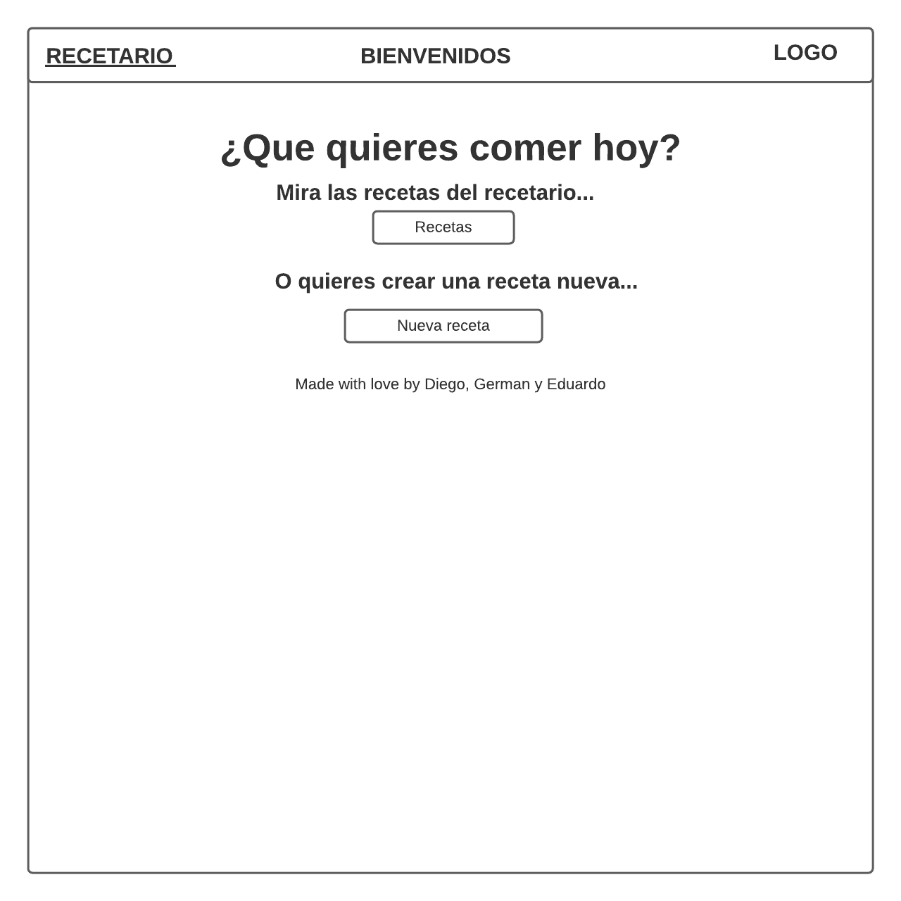
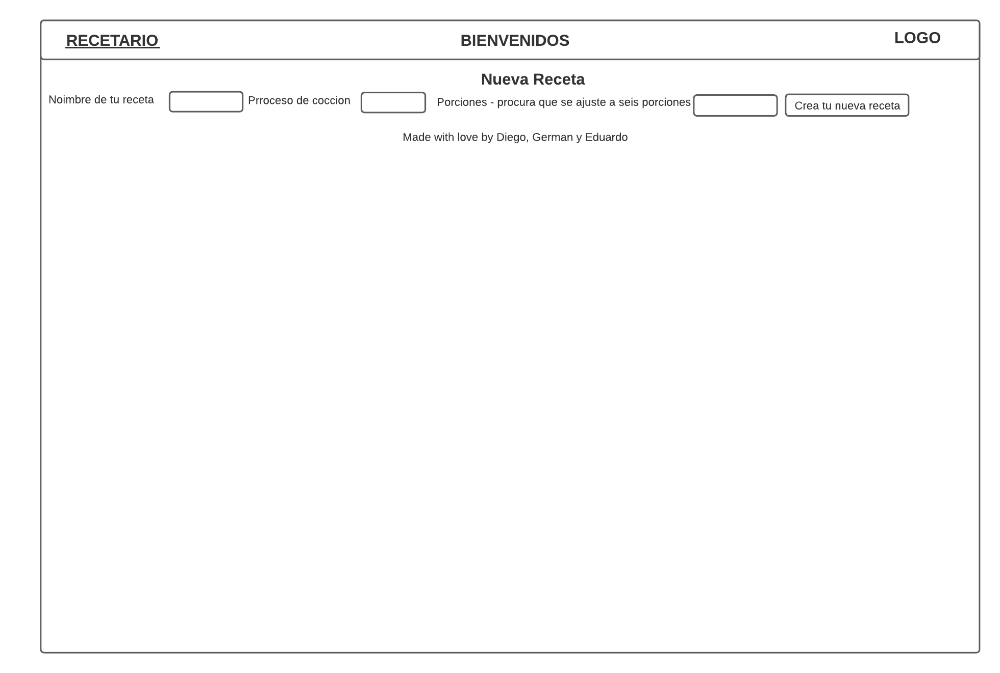
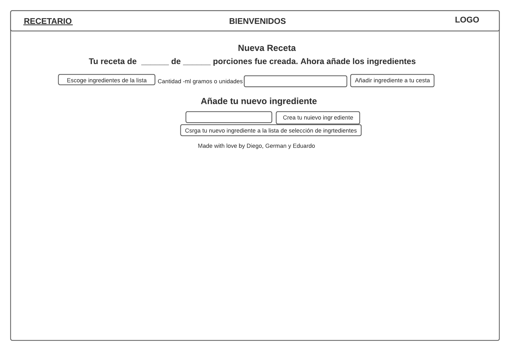

SEI-Project4
General Assembly Project 4 : Monorepo|Recetario|
Goal: To create a full-stack app with React.js, Express, Node, PostgreSQL.
Timeframe

12 days
Technologies used

    Tableplus
    PostgreSQL
    React.js
    JavaScript (ES6) / HTML5 / SCSS
    Git / GitHub
    SASS
    Netlify
    Heroku
    Node
    Nodemon
    Express
    Winston

My app - Recetario

A hosted version of this app can be found on netlify at receipe-book-mredmalak.netlify.app
Application overview

Recetario app which allows users to see or create recipes that can be made using the ingredients in stock or adding some new ingredients, their amounts, and even how to cook them. This was a group project with three developers Diego, German and Eduardo.

Instructions

At the top of the page is a bar with home button and a welcome message. The Recetario homepage displays two sentence to invite to look at by their related buttons. The list of recipes can be edit thanks "Recetas" click access second button, next to the sentence "Mira las recetas del recetario...". The list of recipes can be edit thanks "Crea tu nueva receta" click access second button, next to the sentence "O quieres crear una receta nueva...". To continue edit task the user have to types into the textboxes properties (recipe name, ingredient name, the ingredient amount and how to cook them).

    Through "Mira las recetas del recetario..." click we can look at "Receta" followed by the name of the recipe (once time by each recipe in the recetario), how to cook it and the amount of portions is now shown at the bottom of the page.

    To access at each recipe registred only click at "Ir a esta receta" an the website redirect to focus only one recipe.

In the other button "Nueva receta" it is possible to fill the textboxes to add "nombre de tu receta", "Proceso de cocción" and "Porciones" and click "Crear nueva receta" button to submit all the textboxes and go forward the next display.

    At "Nueva receta" display we look a drop down menu of ingredients where we choose each new ingredient to our recipe and next to this menu we have a textbox "Añadir ingredientes a tu receta" their amounts. Downside we look "Añade tu nuevo ingrediente" with a textbox downside followed by the next button "Carga tu nuevo ingrediente a la lista de selección de ingredientes". This couple of buttons do two task: first button save a new ingredient and the second load the new ingredient into the ingredient dropodown list.

WIREFRAME

EXAMPLES WEB DISPLAY

Thanks to Alex Wheldon and Pedro Martín to suppport into the development of this project
